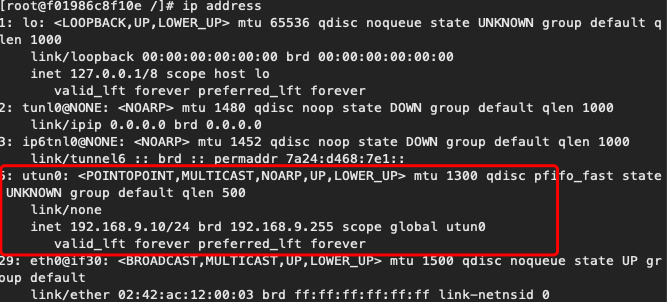

## 一个简单VPN通讯
整体思路

通过该程序，在Linux系统上实现一个Tun通道，并配置ip范围，所有落入这个ip范围内的通讯数据都会被本程序捕获，并加密发送到服务端。并通过服务端进行通讯。

借此达到，客户端机器访问服务端内网的目的。

## 编译

```shell    
 go build
```

## 使用

服务器启动：

```shell
 sudo ./simplevpn -mode=server -listen=127.0.0.1:9786 -pwd=123456 -tun=tun0 -tun_addr=192.168.9.10/24
```

客户端启动：

```shell
 sudo ./simplevpn -mode=client -remote=127.0.0.1:9786 -listen=server:9786 -pwd=123456 -tun=tun0 -tun_addr=192.168.9.10/24
```

## 工作情况
启动程序后，会在本地开启一个tun通道，设置ip范围


在客户端这一边，ping这个地址，会被捕获到，并加密发送到服务端。


可以从log中看到，ping的这个数据，已经被程序从tun中读取到了


服务端这边，也可以看到，数据已经从UDP被接收

